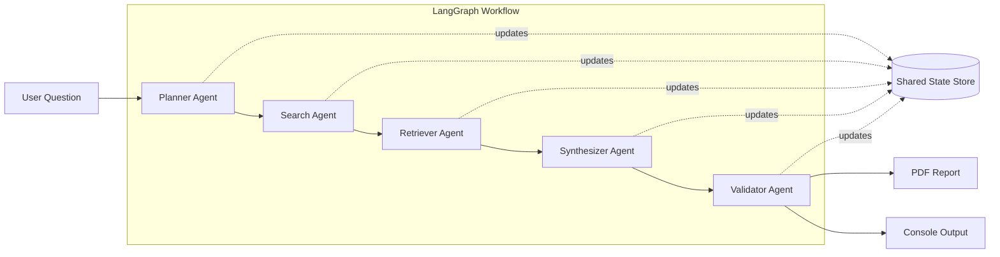
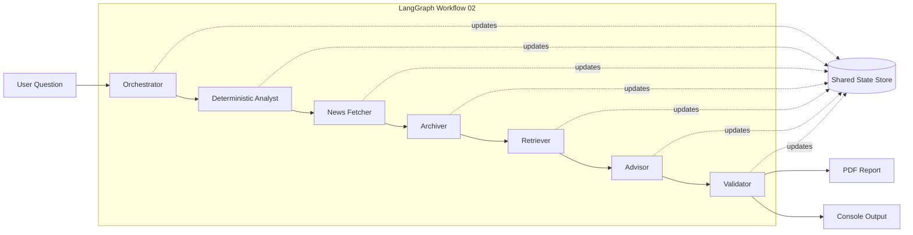

# AI_Agents 🤖
---
### About 🧩: 
- In this repo, I play around with AI Agentization.  Each different folder is a different project.  

---
## ⭐ 01: Market Research Multi-Agent System (LangGraph) 
- **Project Overview:** This repository contains a prototype **multi-agent AI research system** built with **LangGraph** that demonstrates how a structured team of LLM agents can collaboratively reason, search the web, extract evidence, synthesize insights, and validate claims.  The goal of this project is to explore how agentic workflows can turn an open-ended question into a well-structured, evidence-based report in a transparent and auditable way.  I intentionally structured this as a multi-agent system rather than sending everything to one model in a huge prompt and having long context degradation (inducing hallucinations).  By splitting the tasks, I get cleaner reasoning, better grounding, and more predictable outputs.  
- **Highlights:** Given a user question (e.g., *“Summarize recent trends in GLP-1 obesity drugs and their market impact”*), the system runs through a sequence of specialized agents:
  
| Agent / Node | Responsibility | Inputs | Outputs |
|-------------|----------------|--------|---------|
| **Planner Agent** | Decomposes the user’s open-ended question into a structured research plan and generates high-quality, targeted search queries. | User question | • Step-by-step research plan • Curated web search queries |
| **Search Agent** | Executes live web searches using the Tavily API to retrieve recent, relevant sources aligned with the planner’s queries. | Search queries | • Raw web search results (URLs + snippets) |
| **Retriever Agent** | Reads the retrieved sources and extracts the most relevant facts, quotes, and evidence snippets needed to answer the question. | Web search results | • Structured evidence snippets • Key factual highlights |
| **Synthesizer Agent** | Produces a coherent, professional narrative report by synthesizing the extracted evidence into plain-language analysis. | Curated evidence snippets | • Draft narrative report |
| **Validator Agent** | Audits the synthesized report against the original sources, validating which claims are supported by evidence and flagging unsupported statements. | Draft report + evidence | • `VALID` / `INVALID` claim annotations • Final verified report |
  
This creates a transparent pipeline where you can trace how a final answer was constructed.
- **Architecture:** The system is implemented as a **stateful graph** using LangGraph.  Each node:
    - Receives a shared state object  
    - Modifies only its relevant fields  
    - Passes the updated state forward  
- **Technologies:** Python 3.12, LangGraph, LangChain, OpenAI, Pydantic, ReportLab, Tavily Web Search API

- **Output Artifacts:**
    - **Console output** showing each agent’s intermediate results  
    - **A structured PDF report** containing: The original question ,the planner’s reasoning, web search results, extracted evidence, final synthesized report, & claim validation results  

 

- **Mermaid Diagram:**

---

## ⭐ 02: Stock Due Diligence Agent (LangGraph + AWS Bedrock + Local RAG)
- **Project Overview:**  This project explores 🤖 **AI agentization as a system design pattern**, rather than treating LLMs as single-shot answer generators. Instead of asking one model a broad question like “What stock should I buy right now?”-which typically produces an opaque, non-reproducible response-this system is intentionally structured as a **multi-agent workflow** where each agent has a narrow, well-defined responsibility.  

  The result is a production-style stock due diligence agent that transforms a natural-language question into a structured, cited, auditable PDF report, with clear separation between: (1) Deterministic financial facts, (2) Recent market news, (3) Semantic evidence retrieval, and (4) LLM reasoning.
  
## 📄 Example Output Due Diligence PDF Reports
  `Please ignore the warnings in the report.  I was getting throttled by Alpha Vantage API (because I'm on free tier) and appending warnings to the report, lol. If you download the pdf, the news links should be clickable.`  
    
**Report Preview:**  
➡️ Click on the png images to open the full report 🔗
<table><tr><td align="center"> 📟 NVDA</td><td align="center"> ✨ PLTR</td><td align="center"> 🚗 TSLA</td></tr></table>

- **Why multi-agentization instead of 💬 “just ask ChatGPT?”:**
  - Asking a general LLM `“What stock should I buy?”` has several fundamental limitations:
    - **No control over evidence**. The model is trained on old outdated data & the data it sees may not be factual
    - **No separation between facts and reasoning**.  Market data, news, and analysis are blended together in one opaque response.
    - **No auditability**
    - **High variance**. The same question asked twice can yield materially different answers.

  - Rather than relying on a single model to “do everything at once,” the workflow decomposes the task into specialized agents coordinated by LangGraph. This mirrors how real research and analytics teams operate: data collection first, evidence curation second, analysis last.
    - Deterministic agents fetch structured financial data from trusted APIs (Alpha Vantage + SEC).
    - A dedicated news agent gathers recent, bounded market context with explicit recency constraints.
    - The LLM is used strictly for reasoning and synthesis, not data acquisition.
    - A validator agent performs a lightweight claim audit, making reasoning inspectable rather than implicit.
  - This design produces outputs that are **more stable, more explainable, and more reusable** than a single-shot LLM answer.
  - I built this agentic workflow to create an auditable research system to do due dillegence on stocks for me because I just don't have the time to do the research.  I stay pretty busy between work, jiu-jitsu, and constantly programming.  

- **🏗️ Intentional Design Choices:**
  - **Separation of concerns:**  I intentionally segregated factual data from news (which could cause noise)
    - Factual/deterministic data is collected from Alpha Vantage + SEC through API calls
    - Recent news is collected from FinnHub API call because Finnhub allows me to select articles from a date range through the call 

  - **Deliberate chunking strategy:**  
    - Two separate vector indexes:
        - `deterministic/` - **Financial facts** (Alpha Vantage + SEC data API call)
        - `news/` → **Recent news articles** (Finnhub API call).  The system only surfaces news from the last 365 days and caps total articles, avoiding “recency noise."
    - I then added metadata tags so that I could filter my retrievals later on prior to sending data to the LLM

  - **Semantic Retrieval with Metadata Guardrails:**  
  Semantic search is used as a **candidate generator**, not the final authority. Query embeddings retrieve relevant chunks from two local vector indexes—one for deterministic financial facts and one for recent news. Before any evidence reaches the LLM, results are **filtered using structured metadata** (recency constraints, deduplication, and source attribution).  
  This ensures the model reasons only over evidence that is relevant, recent, and contextually valid, while avoiding stale or misleading information.

  - **Reliability & Observability:**  
    - For this script, I was caching API call data to local memory with time to live variables to save on $ and to perform less API calls.  This is because I'm using the free tier for the API calls.
    - When the API calls would fail, I scripted in a graceful fallback to using older/stale cache data
    - Exponential backoff on Bedrock throttling.  
    - Progress tracking across the entire graph for observability.

  - **Claim traceability:**  
    - The report requires inline citations like `[chunk_id]`.  
    - A validator agent performs a lightweight “claim audit,” marking which lines are supported by at least one verifiable source URL.

- **🤖 Agent roles (what the agent does end-to-end):**  
  
| Agent | Primary Responsibility | Key Outputs |
|------|------------------------|-------------|
| **Orchestrator** | Entry point for the workflow. Extracts exactly one ticker from the user question and coordinates downstream agents. | Validated ticker, targeted retrieval queries |
| **Deterministic Analyst** | Fetches structured, factual financial data from trusted APIs (Alpha Vantage, SEC EDGAR) and normalizes it into a stable snapshot. | Prices, fundamentals, filings summary |
| **News Agent** | Collects recent company news with explicit time bounds, caching, and deduplication. | Curated set of recent news articles |
| **Archiver (Local RAG)** | Builds and maintains local vector indexes for both deterministic facts and news, using content hashes to avoid redundant embeddings. | Two local vector stores (`deterministic/`, `news/`) |
| **Retriever** | Performs semantic search over both indexes and applies metadata filters (recency, deduplication, source constraints). | Curated evidence set for reasoning |
| **Advisor** | Uses the curated evidence to generate a structured investment analysis with explicit citations. | Rating, risks, key drivers, confidence, gaps |
| **Validator** | Audits each claim in the report to ensure it is supported by at least one verifiable source. | Claim audit section with citation coverage |

- **Architecture:**  
  The system is implemented as a **stateful LangGraph workflow** where each node:
  - Reads from a shared `AgentState`  
  - Writes only its relevant outputs  
  - Updates progress for observability  
  - Hands off to the next specialized agent

- **Technologies:** Python 3.12, AWS, LangChain, LangGraph, LlamaIndex, Pydantic, & ReportLab.  And then AlphaVantage, Finnhub, and SEC EDGAR APIs

- **Output Artifacts:**
  - Rich console logs showing progress and failures  
  - A **sourced PDF report** including: Original question, ticker extraction result, deterministic financial,retrieved evidence, LLM-written investment view, & claim validation results  

- **Initial Problems:**  
  I originally began this project about a month ago by leaning heavily on general web search (`Tavily`) as the primary knowledge source. Early versions of the system tried to answer investment questions purely from live web results, but I quickly ran into two practical problems:  
  1) **Recency control was too weak.** Tavily returned a mix of high-quality recent sources and noisy, low-signal content, and I didn’t have a reliable way to systematically discriminate between “material, decision-relevant news” and background chatter.  
  2) **Structured financial data was hard to scrape cleanly.** Key facts like prices, cash flows, balance sheets, and filings were scattered across websites in tables, PDFs, or interactive dashboards that were brittle to parse with generic scraping.  

  After a few iterations, I deliberately **re-architected the entire system** around a deterministic data layer first-pulling structured data from trusted APIs (Alpha Vantage + SEC EDGAR) and treating news as a separate, curated signal rather than the foundation of reasoning. This shift made the system far more reliable & repeatable.  I intentionally avoided brittle web table scraping in favor of structured APIs.  

- **Mermaid Diagram:**

